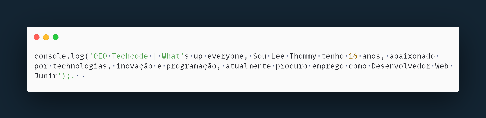
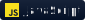
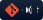
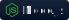
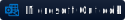
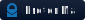
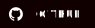
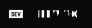

<h1 style="color:#fff; font-family: 'MonoLisa'; font-size: 4em;">👋 Hi, I’m  
@waltcoder</h1>

&nbsp;

  

## 💻 &nbsp;Tech Stack

&nbsp;
&nbsp;
&nbsp;
&nbsp;
&nbsp;
&nbsp;
&nbsp;

## 📖 &nbsp;Studying

&nbsp;
&nbsp;
&nbsp;
&nbsp;

## 📫 &nbsp;Contact Me

## 🔗 &nbsp;Social

<!-- 

  

 -->
<!--- - 👋 Hi, I’m @thommcoder
- 👀 I’m interested in ...
- 🌱 I’m currently learning ...
- 💞️ I’m looking to collaborate on ...
- 📫 How to reach me ...
--->
<!---
thommcoder/thommcoder is a ✨ special ✨ repository because its `README.md` (this file) appears on your GitHub profile.
You can click the Preview link to take a look at your changes.
--->

